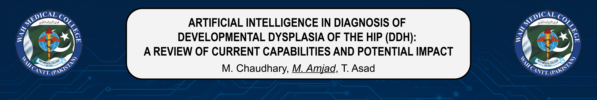

<h3>
 </h3> 
<h1>📠13th Annual Shifa Scholars Day 2024 📜 Presentation Resources</h1>
<!-- <h2><i>ARTIFICIAL INTELLIGENCE IN DIAGNOSIS OF DEVELOPMENTAL DYSPLASIA OF THE HIP (DDH): A REVIEW OF CURRENT CAPABILITIES AND POTENTIAL IMPACT</i>  </h2>-->

 
Welcome to our digital project page for the 13th Annual Shifa Scholars Day 2024! Here, you will find all the resources related to our presentation, including downloadable materials and relevant contact information.

<h2>📠What’s Included</h2>

- **[Poster PDF:](DOWNLOADS/Poster_SHIFA_AiDDH.pdf)** Download the poster we presented at the conference. 📊
- **[Reference List:](DOWNLOADS/References.txt)** : A comprehensive list of all references cited in the poster. 📄

<h2>👩‍🔬 Authors</h2>

---

### Primary Author

**Mueed Chaudhary**  
Wah Medical College  
   

A US-IMG with a strong interest in orthopedic surgery research. Has experience in conducting meta-analyses and database studies, and is skilled in creating 3D + vector graphics for research papers. Actively exploring how artificial intelligence can enhance orthopedic practices.

---

### Co-Author (Presenter)

**Maryam Amjad**  
Wah Medical College  
 

Second year Medical student with a keen interest in research. Previously gave an oral presentation on this topic and is now presenting this poster. Enthusiastic about contributing to research and expanding their knowledge. Ambassador to various research societies across Pakistan.

---

### Co-Author

**Talha Asad**  
Wah Medical College  
 

Third-year medical student who assisted with performing literature reviews and managing data collection. Passionate about innovation and improving medical education.

---

<h3>📬 Contact Us</h3>

If you have any questions or would like to discuss our research further, feel free to reach out through our contact information provided above.
